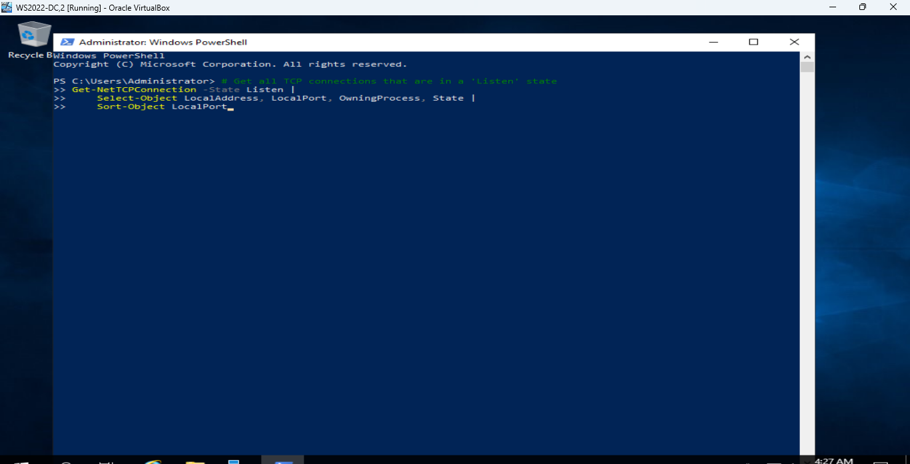
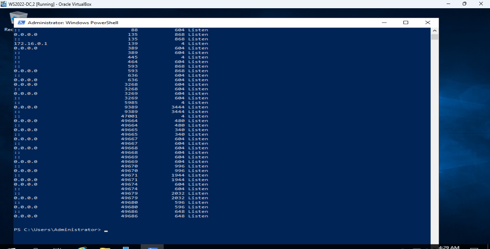

# Active-Directory-Network-Analysis
Automating port discovery and network visibility within an Active Directory home Lab environment using PowerShell
# Active Directory Lab: Automated Port Discovery & Network Visibility

## 📌 Project Overview
As part of an ongoing initiative to strengthen security posture and maintain network hygiene within my Active Directory home lab (`JUMBO.local`), I implemented an automated network analysis task. The objective of this lab was to write and execute a script to identify open ports listening for active connections across domain assets, simulating a baseline security audit.

Identifying listening ports is critical for minimizing the attack surface, detecting unauthorized services, and ensuring proper firewall configurations across Domain Controllers and client machines.

---

## 🛠️ Tools & Technologies Used
* **Operating System:** Windows Server 2019/2022 (Domain Controller) / Windows 10/11 (Client VM)
* **Environment:** Oracle VM VirtualBox
* **Automation Language:** PowerShell
* **Core Commands:** `Get-NetTCPConnection`, `Test-NetConnection`

---

## 🚀 Step-by-Step Implementation

### Phase 1: Script Development & Logic
To gather real-time data on active network listeners without relying on third-party scanners, a PowerShell script was utilized to filter TCP connections specifically in a `Listen` state. 

